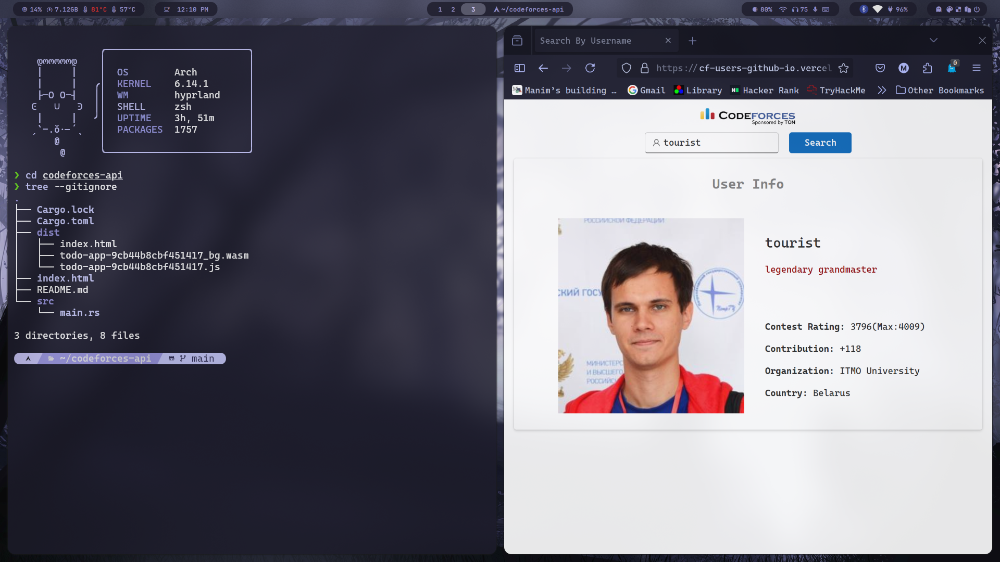

# Codeforces Explorer

A comprehensive client-side explorer for the [Codeforces API](https://codeforces.com/api/help), built with [Leptos](https://leptos.dev) (CSR WASM) and [Thaw UI](https://github.com/thaw-ui/thaw).



## Highlights

- **Dark & light theme** with persistence, splash screen, polished responsive shell
- **Shareable deep links** — every tab and search is URL-addressable (`#/user/tourist`, `#/compare/a/b`, …)
- **Local caching** of heavy endpoints (contests, problem pool, submissions) so repeat visits load instantly
- **CSV export** for standings, rating changes, rated list, comparisons and submission history
- **Zero backend** — everything runs in the browser via the public Codeforces API

## Features by tab

| Tab | Features | Endpoints |
| --- | --- | --- |
| **User** | Multi-handle profile cards, solve-analytics dashboard: activity heatmap + AC streaks, verdict/language/tag distributions, solved-difficulty histogram, acceptance stats; personalized practice recommendations from the full problem pool; rating history chart + table; recent submissions with CSV export; blog entries with inline reader and comments | `user.info`, `user.rating`, `user.status`, `user.blogEntries`, `blogEntry.view`, `blogEntry.comments`, `problemset.problems` |
| **Compare** | Side-by-side comparison of 2–3 users: overlaid rating-history chart, head-to-head metric table with winners highlighted, optional solve-count/acceptance comparison, share links + CSV export | `user.info`, `user.rating`, `user.status` |
| **Contests** | Upcoming contests with live countdown cards, quick jump by contest ID, name/phase/type filters, sorting; per-contest inspector: medal-tinted standings with CSV export, rating-change summary + export, hacks feed, submission browser | `contest.list`, `contest.standings`, `contest.ratingChanges`, `contest.hacks`, `contest.status` |
| **Problems** | Full problem pool with dual-tag AND filter, rating range, name search, page-size control, difficulty histogram of the filtered set, random problem picker, solved-count bars | `problemset.problems` |
| **Recent** | Live global feed (blogs/comments) with relative timestamps and rating chips; complete rated list with country/org filters, sorting, medals for the podium and CSV export | `recentActions`, `user.ratedList` |

Extras: official rank colors everywhere, SVG rating charts with tooltips, colored verdicts/deltas, deep links to codeforces.com.

## Development

```sh
rustup target add wasm32-unknown-unknown
cargo install trunk
trunk serve        # dev server with hot reload
```

## Deployment

- **GitHub Pages**: `.github/workflows/pages.yml` builds with Trunk (`--public-url /cf-users.github.io/`) on every push to `main` and publishes `dist/` to Pages.
- **Vercel**: existing workflows also build with Trunk and deploy on pushes/PRs.

## License

MIT
